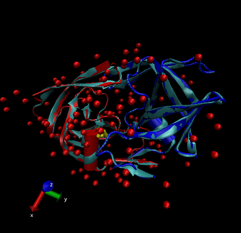

>1: Introduction to the RCSB Protein Data Bank (PDB)

- PDB statistics

- Download a CSV file from the PDB site (accessible from “Analyze” > “PDB Statistics” > “by Experimental Method and Molecular Type”. Move this CSV file into your RStudio project and use it to answer the following questions:

```{r}
db <- read.csv("Data Export Summary.csv", row.names=1)
head(db)
```


>Q1: What percentage of structures in the PDB are solved by X-Ray and Electron Microscopy.

```{r}
method.sums <- colSums(db)
round((method.sums/method.sums["Total"]) * 100, 2)
```

- 87.55% by X-ray and 4.92% by EM. 

>Q2: What proportion of structures in the PDB are protein?

```{r}
round((db$Total/method.sums["Total"]) * 100, 2)
```

- 87.36%

>Q3: Type HIV in the PDB website search box on the home page and determine how many HIV-1 protease structures are in the current PDB?

- There are 1828 HIV-1 protease structures in the current PDB


- *The PDB format*

> 2. Visualizing the HIV-1 protease structure

- Using Atom Selections

>Q4: Water molecules normally have 3 atoms. Why do we see just one atom per water molecule in this structure?

- 

>Q5: There is a conserved water molecule in the binding site. Can you identify this water molecule? What residue number does this water molecule have (see note below)?


## VMD Structure visualization image




> 3. Introduction to Bio3D in R

```{r}
library(bio3d)

```

- Reading PDB file data into R

```{r}
pdb <- read.pdb("1hsg")

```

- To get a quick summary of the contents of the pdb object you just created you can issue the command print(pdb) or simply type pdb (which is equivalent in this case):

```{r}
pdb
```

> Q7: How many amino acid residues are there in this pdb object? 

- 198

> Q8: Name one of the two non-protein residues? 

- MK1 

> Q9: How many protein chains are in this structure? 

- 2

```{r}
aa123(pdbseq(pdb))
```

Plot of B-factor

```{r}
plot.bio3d(pdb$atom$b, sse=pdb)
```

The ATOM records

```{r}
head(pdb$atom)
```


Note that the attributes (+ attr:) of this object are listed on the last couple of lines. To find the attributes of any such object you can use:

```{r}
attributes(pdb)

```

To access these individual attributes we use the dollar-attribute name convention that is common with R list objects. For example, to access the atom attribute or component use pdb$atom:


```{r}
head(pdb$atom)

```

