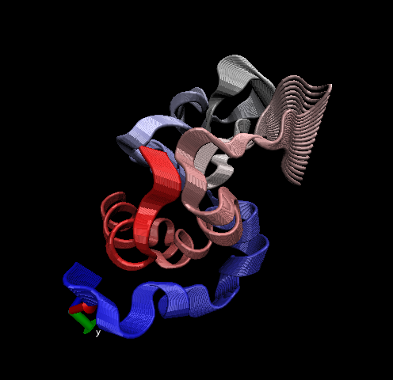
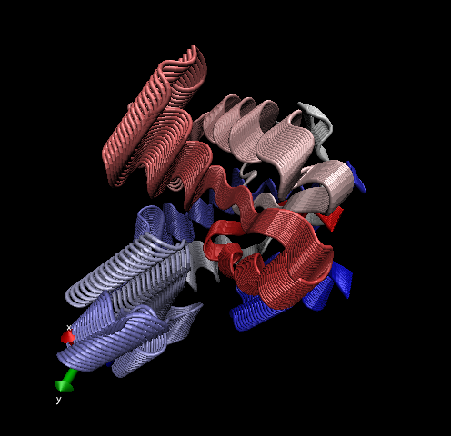

> 3. Introduction to Bio3D in R

```{r}
library(bio3d)

```

- Reading PDB file data into R

```{r}
pdb <- read.pdb("1hsg")

```

- To get a quick summary of the contents of the pdb object you just created you can issue the command print(pdb) or simply type pdb (which is equivalent in this case):

```{r}
pdb
```

> Q7: How many amino acid residues are there in this pdb object? 

- 198

> Q8: Name one of the two non-protein residues? 

- MK1 

> Q9: How many protein chains are in this structure? 

- 2

```{r}
aa123(pdbseq(pdb))
```

Plot of B-factor

```{r}
plot.bio3d(pdb$atom$b, sse=pdb)
```

The ATOM records

```{r}
head(pdb$atom)
```


Note that the attributes (+ attr:) of this object are listed on the last couple of lines. To find the attributes of any such object you can use:

```{r}
attributes(pdb)

```

To access these individual attributes we use the dollar-attribute name convention that is common with R list objects. For example, to access the atom attribute or component use pdb$atom:


```{r}
head(pdb$atom)

```


> 4. Comparative structure analysis of Adenylate Kinase

- Goal of this section is to perform principal component analysis (PCA) on the complete collection of Adenylate kinase structures in the protein data-bank (PDB)

Using the bio3d package

```{r}
library(bio3d)

pdb <- read.pdb("1hel")
pdb
```

Let's use a bioiformatics mthod called NMA (Normal Mode Analysis) to predict the dynamics (flexibility) of this enzyme.

```{r}
modes <- nma(pdb)
plot(modes)
```

Now let's make a "movie" of its predicted motion. This is often called a "trajectory". 

```{r}
mktrj(modes, file = "nma.pdb")
```

We can now open up this new file in VMD. Changing the coloring method to index and drawing method to tube, we can visualize the protein. Clicking the play button the in lower right hand corner of VMD Main let's the movie play and the protein move. 


```{r}
#
```

Rmd will not knit with the insertion of png image so I put it as a comment in a code chunk...

**Overview**

- Starting from only one Adk PDB identifier (PDB ID: 1AKE) we will search the entire PDB for related structures using BLAST, fetch, align and superpose the identified structures, perform PCA and finally calculate the normal modes of each individual structure in order to probe for potential differences in structural flexibility.

**Setup**

- First, install the necessary R-packages 

```{r}
# Install packages in the R console not your Rmd

#install.packages("bio3d")
#install.packages("ggplot2")
#install.packages("ggrepel")
#install.packages("devtools")
#install.packages("BiocManager")

#BiocManager::install("msa")
#devtools::install_bitbucket("Grantlab/bio3d-view")
```

> Q10. Which of the packages above is found only on BioConductor and not CRAN? 

- msa

> Q11. Which of the above packages is not found on BioConductor or CRAN?: 

- Grantlab/bio3d-view

> Q12. True or False? Functions from the devtools package can be used to install packages from GitHub and BitBucket?

- TRUE


**Search and retrieve ADK structures**

```{r}
library(bio3d)
aa <- get.seq("1ake_A")
aa
```

> Q13. How many amino acids are in this sequence, i.e. how long is this sequence? 

- 214


```{r}
# Now you can run BLAST from R
blast <- blast.pdb(aa)
```

```{r}
hits <- plot(blast)
```

```{r}
hits$pdb.id
```

We can now use function get.pdb() and pdbslit() to fetch and parse the identified structures.


```{r}
# Download releated PDB files
files <- get.pdb(hits$pdb.id, path="pdbs", split=TRUE, gzip=TRUE)
```

^ Takes hits files and makes a directory ("pdbs") and puts it there -- like manually going and downloading all pdb files from the pdb data base and compiling it all into a single file. 

What we've done: workflow --> 1AKE -> sequenced it  -> blast against PDB database -> get all structures that we want to do comparative analysis on -> alignment 

Now that we have all of the pdb files...

Lets **Align and superpose structures (multiple structure sequence alignment)**

 We will use the pdbaln() function to align and also optionally fit (i.e. superpose) the identified PDB structures

```{r}
# Align related PDBs
pdbs <- pdbaln(files, fit = TRUE)#, exefile="msa")
```

```{r}
# Make a vector containing PDB codes for figure axis
ids <- basename.pdb(pdbs$id)

# Draw schematic alignment
plot(pdbs, labels=ids)
```

^A schematic representation of alignment. Grey regions depict aligned residues, while white depict gap regions. The red bar at the top depict sequence conservation.

**Principal component analysis**

- Function pca() provides principal component analysis (PCA) of the structure data. PCA is a statistical approach used to transform a data set down to a few important components that describe the directions where there is most variance. In terms of protein structures PCA is used to capture major structural variations within an ensemble of structures.

- PCA can be performed on the structural ensemble (stored in the pdbs object) with the function pca.xyz(), or more simply pca().

- We will use the bio3d pca() function which is designed for protein structure data. 

```{r}
# Perform PCA
pc.xray <- pca(pdbs)
plot(pc.xray)
```

^ Results of PCA on Adenylate kinase X-ray structures. Each dot represents one PDB structure.

> 5. Optional further visualization

Make a trajectory visualization of the motion captured by the first Principal Component

```{r}
# Visualize first principal component
pc1 <- mktrj(pc.xray, pc=1, file="pc_1.pdb")
```

^Can open up the file and view in VMD, same as before 


```{r}
#
```

Rmd will not knit with the insertion of png image so I put it as a comment in a code chunk...


Function rmsd() will calculate all pairwise RMSD values of the structural ensemble. This facilitates clustering analysis based on the pairwise structural deviation:

```{r}
# Calculate RMSD
rd <- rmsd(pdbs)

# Structure-based clustering
hc.rd <- hclust(dist(rd))
grps.rd <- cutree(hc.rd, k=3)

plot(pc.xray, 1:2, col="grey50", bg=grps.rd, pch=21, cex=1)
```

^Projection of Adenylate kinase X-ray structures. Each dot represents one PDB structure

- The plot shows a conformer plot – a low-dimensional representation of the conformational variability within the ensemble of PDB structures. The plot is obtained by projecting the individual structures onto two selected PCs (e.g. PC-1 and PC-2). These projections display the inter-conformer relationship in terms of the conformational differences described by the selected PCs.


> 6. Normal mode analysis

```{r}
# NMA of all structures
modes <- nma(pdbs)
```

```{r}
plot(modes, pdbs, col=grps.rd)

```

> Q14. What do you note about this plot? Are the black and colored lines similar or different? Where do you think they differ most and why?

- The black and colored lines are different. They differ most at residues 125 - 150, likely because they have the most divergent structures at these locations. 

Collectively these results indicate the existence of two major distinct conformational states for Adk. These differ by a collective low frequency displacement of two nucleotide-binding site regions that display distinct flexibilities upon nucleotide binding.


